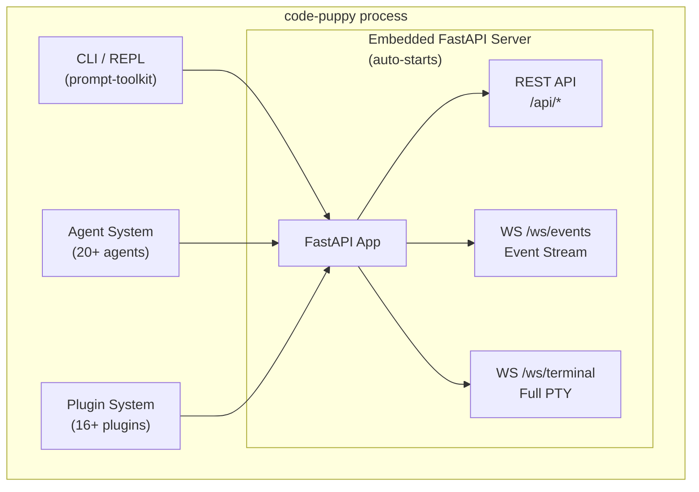
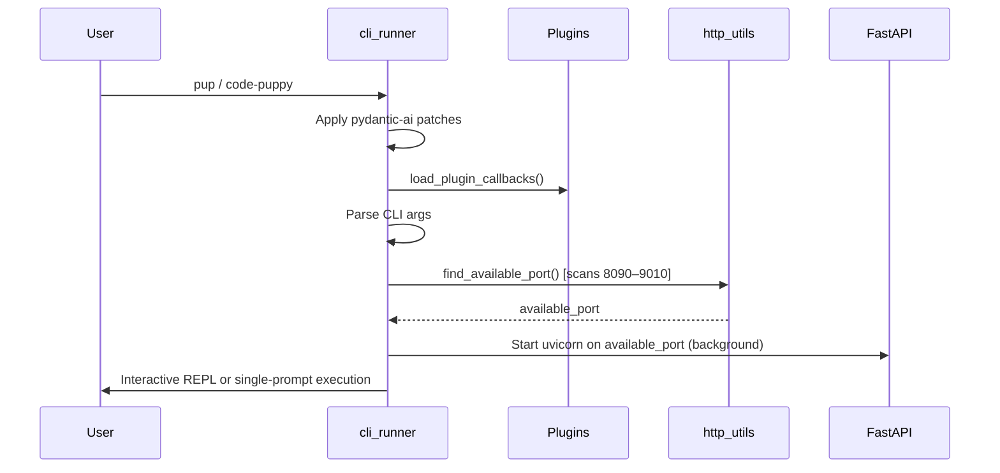
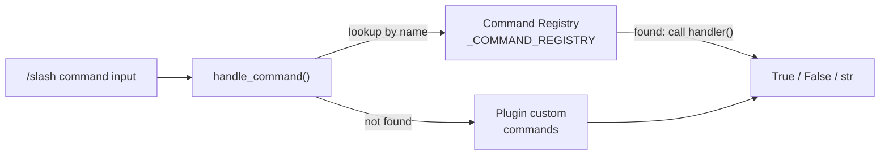
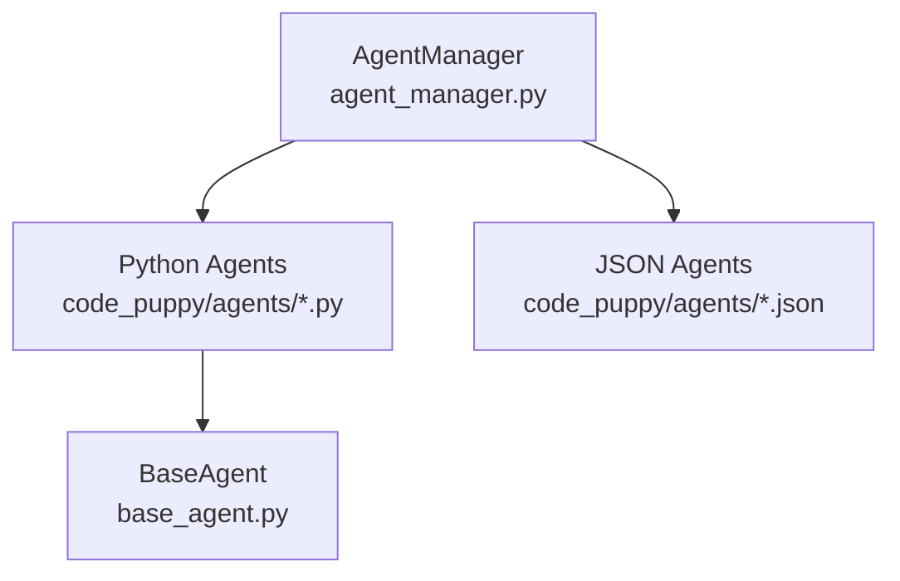
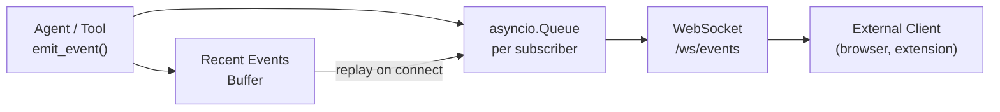
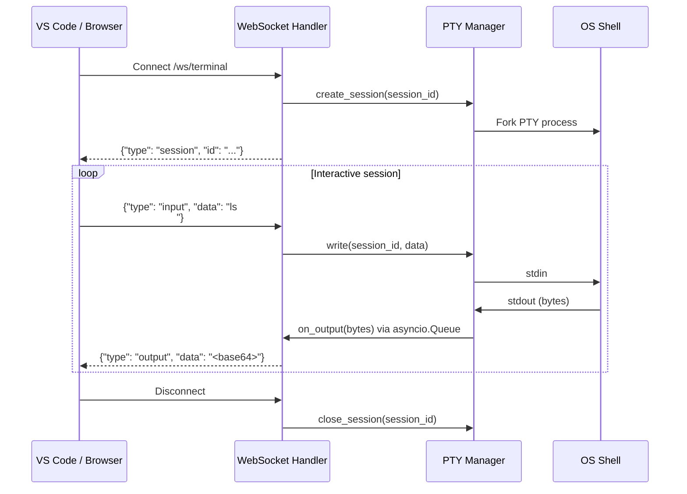

# Code Puppy — Current Architecture

> **Purpose:** Baseline understanding of how code-puppy is structured today,
> focusing on the surfaces relevant to building a VS Code extension.
> This document is descriptive — it captures what exists, not what we plan to build.

---

## Sources

All observations in this document are derived directly from the codebase. Key files referenced:

| File | What it tells us |
|------|-----------------|
| [`code_puppy/cli_runner.py`](../../code_puppy/cli_runner.py) | Startup sequence, port selection |
| [`code_puppy/api/app.py`](../../code_puppy/api/app.py) | FastAPI app factory, middleware, CORS |
| [`code_puppy/api/main.py`](../../code_puppy/api/main.py) | Standalone server entry point |
| [`code_puppy/api/websocket.py`](../../code_puppy/api/websocket.py) | WebSocket endpoint definitions |
| [`code_puppy/api/pty_manager.py`](../../code_puppy/api/pty_manager.py) | PTY session lifecycle |
| [`code_puppy/api/routers/agents.py`](../../code_puppy/api/routers/agents.py) | Agent listing endpoint |
| [`code_puppy/api/routers/commands.py`](../../code_puppy/api/routers/commands.py) | Command execution endpoints |
| [`code_puppy/api/routers/sessions.py`](../../code_puppy/api/routers/sessions.py) | Session management endpoints |
| [`code_puppy/api/routers/config.py`](../../code_puppy/api/routers/config.py) | Config read/write endpoints |
| [`code_puppy/command_line/command_registry.py`](../../code_puppy/command_line/command_registry.py) | Command decorator and registry |
| [`code_puppy/command_line/command_handler.py`](../../code_puppy/command_line/command_handler.py) | Command dispatcher |
| [`code_puppy/plugins/frontend_emitter/emitter.py`](../../code_puppy/plugins/frontend_emitter/emitter.py) | Event broadcasting system |
| [`code_puppy/http_utils.py`](../../code_puppy/http_utils.py) | `find_available_port()` implementation |
| [`pyproject.toml`](../../pyproject.toml) | Dependency versions |

**External references:**
- [XDG Base Directory Specification](https://specifications.freedesktop.org/basedir-spec/latest/) — freedesktop.org
- [FastAPI Documentation](https://fastapi.tiangolo.com/) — fastapi.tiangolo.com
- [Uvicorn Documentation](https://www.uvicorn.org/) — uvicorn.org
- [WebSocket Protocol RFC 6455](https://datatracker.ietf.org/doc/html/rfc6455) — IETF
- [Pydantic-AI Documentation](https://ai.pydantic.dev/) — ai.pydantic.dev

---

## 1. High-Level Overview

Code Puppy is a Python-based AI coding agent that runs as a CLI tool. It supports
multiple LLM providers (Anthropic, OpenAI, Google, Cerebras, Ollama, and 60+ others),
a rich plugin system, multi-agent orchestration, and an embedded HTTP/WebSocket API
server that starts automatically alongside the CLI.

---

## 2. Entry Point and Startup Sequence

**Source files:** [`main.py`](../../code_puppy/main.py) → [`cli_runner.py`](../../code_puppy/cli_runner.py)

When a user runs `pup` or `code-puppy`:

**Key detail:** The port is dynamic and chosen at runtime. There is currently
**no mechanism to persist the chosen port** to a file or registry for external
clients to discover. See [Section 8 (Gaps)](#8-security-posture-current) for implications.

---

## 3. The Embedded API Server

**Source:** [`code_puppy/api/app.py`](../../code_puppy/api/app.py), [`code_puppy/api/main.py`](../../code_puppy/api/main.py)

The API server's default standalone port is `8765` (defined in `api/main.py`), but when
launched from the CLI it uses the dynamically found port from `find_available_port()`.

### 3.1 REST Endpoints

| Method | Path | Description | Source |
|--------|------|-------------|--------|
| `GET` | `/health` | Health check — returns `{"status": "healthy"}` | `app.py:165` |
| `GET` | `/api/agents/` | List all agents (name, display_name, description) | `routers/agents.py:14` |
| `GET` | `/api/commands/` | List all registered `/slash` commands | `routers/commands.py:73` |
| `GET` | `/api/commands/{name}` | Get details of a specific command | `routers/commands.py:101` |
| `POST` | `/api/commands/execute` | Execute a slash command by string | `routers/commands.py:132` |
| `POST` | `/api/commands/autocomplete` | Autocomplete suggestions for partial input | `routers/commands.py:169` |
| `GET` | `/api/sessions/` | List all saved sessions | `routers/sessions.py:93` |
| `GET` | `/api/sessions/{id}` | Get session metadata | `routers/sessions.py:135` |
| `GET` | `/api/sessions/{id}/messages` | Full message history for a session | `routers/sessions.py:174` |
| `DELETE` | `/api/sessions/{id}` | Delete a session | `routers/sessions.py:209` |
| `GET` | `/api/config/` | List all config keys and current values | `routers/config.py:20` |
| `GET` | `/api/config/keys` | List valid config key names | `routers/config.py:31` |
| `GET` | `/api/config/{key}` | Get a specific config value | `routers/config.py:39` |
| `PUT` | `/api/config/{key}` | Set a config value | `routers/config.py:54` |
| `DELETE` | `/api/config/{key}` | Reset a config value to default | `routers/config.py:69` |
| `GET` | `/docs` | Auto-generated Swagger UI (FastAPI built-in) | `app.py:88` |
| `GET` | `/terminal` | Serves the web-based terminal HTML page | `app.py:154` |

### 3.2 WebSocket Endpoints

**Source:** [`code_puppy/api/websocket.py`](../../code_puppy/api/websocket.py)

| Path | Description |
|------|-------------|
| `/ws/terminal` | Full PTY terminal — bidirectional input/output/resize |
| `/ws/events` | Real-time event stream from the agent |
| `/ws/health` | Echo health check |

#### `/ws/terminal` — PTY Terminal (`websocket.py:57`)
- Creates a real OS-level PTY session per connection
- **Client → Server:** `{"type": "input", "data": "..."}` and `{"type": "resize", "cols": 80, "rows": 24}`
- **Server → Client:** `{"type": "output", "data": "<base64-encoded bytes>"}` and `{"type": "session", "id": "..."}`
- Full interactive terminal: all of code-puppy's REPL runs through this

#### `/ws/events` — Event Stream (`websocket.py:22`)
- Driven by the `frontend_emitter` plugin
- New subscribers automatically receive a **replay of recent events** on connect
- Server sends keepalive `{"type": "ping"}` every 30 seconds
- Events shape: `{"id": "uuid", "type": "event_type", "timestamp": "ISO8601", "data": {...}}`
- **No equivalent HTTP SSE endpoint exists** — WebSocket only

---

## 4. The Command Line System

**Source directory:** [`code_puppy/command_line/`](../../code_puppy/command_line/)

### 4.1 Command Registry (`command_registry.py`)
- Decorator-based: `@register_command(name, description, usage, aliases, category)`
- Global in-process registry: `_COMMAND_REGISTRY: Dict[str, CommandInfo]`
- Each `CommandInfo` holds: name, description, handler function, usage, aliases, category

### 4.2 Command Handler (`command_handler.py`)
- `handle_command(command: str)` — the single dispatcher
- Returns `True` (handled), `False` (not handled), or a `str` (to be processed as agent input)

### 4.3 Available Built-in Commands
Registered in [`core_commands.py`](../../code_puppy/command_line/core_commands.py):
`/help`, `/cd`, `/tools`, `/motd`, `/agent`, `/model`, `/set`, `/add_model`,
`/paste`, `/mcp`, `/session`, `/skills`, `/colors`, `/onboard`, `/uc`, and more

### 4.4 API Exposure
All commands accessible via REST:
- `GET /api/commands/` — lists all commands
- `POST /api/commands/execute` — calls `handle_command()` directly

---

## 5. The Agent System

**Source directory:** [`code_puppy/agents/`](../../code_puppy/agents/)

- All agents inherit from `BaseAgent` ([`base_agent.py`](../../code_puppy/agents/base_agent.py))
- `AgentManager` maintains unified registry, handles switching and session persistence
- Agent selection is persisted per terminal session using PPID

### Key Agents
| Agent | Role | Source |
|-------|------|--------|
| `code-puppy` | Default general-purpose agent | `agent_code_puppy.py` |
| `pack-leader` | Orchestrates parallel multi-agent workflows | `agent_pack_leader.py` |
| `security-auditor` | Security analysis | `agent_security_auditor.py` |
| `code-reviewer` | Code quality review | `agent_code_reviewer.py` |
| `qa-expert` | Testing and QA | `agent_qa_expert.py` |
| `agent-creator` | Builds new custom agents | `agent_creator_agent.py` |

---

## 6. The Event System

**Source:** [`code_puppy/plugins/frontend_emitter/emitter.py`](../../code_puppy/plugins/frontend_emitter/emitter.py)

- `emit_event(event_type, data)` broadcasts to all active subscriber queues
- Configurable buffer size for event replay to new subscribers
- Connected exclusively to `/ws/events` — no HTTP SSE equivalent

---

## 7. Configuration and File Locations

**Source:** [`code_puppy/config.py`](../../code_puppy/config.py)

Code Puppy follows the [XDG Base Directory Specification](https://specifications.freedesktop.org/basedir-spec/latest/),
a standard from the [freedesktop.org Cross-Desktop Group](https://www.freedesktop.org/wiki/)
that defines where applications should store files on Linux/Unix systems.

| XDG Variable | Default if unset | code-puppy usage |
|---|---|---|
| `$XDG_CONFIG_HOME` | `~/.config/` | Config file: `puppy.cfg` |
| `$XDG_DATA_HOME` | `~/.local/share/` | Sessions, agents, plugins |
| `$XDG_STATE_HOME` | `~/.local/state/` | PID file, runtime state |

code-puppy defaults all of these to `~/.code_puppy/` if the XDG variables are not set.

**Key config values relevant to the API:**
- `frontend_emitter_enabled` — toggles the event emitter (default: `true`)
- `frontend_emitter_queue_size` — max queue depth per subscriber
- `frontend_emitter_max_recent_events` — how many events to replay on connect

**PID file:** Written to `{STATE_DIR}/api_server.pid` on shutdown (source: `app.py:75`)

---

## 8. Security Posture (Current)

**Source:** [`code_puppy/api/app.py`](../../code_puppy/api/app.py)

| Aspect | Current State | Source |
|--------|---------------|--------|
| Authentication | None — all endpoints are open | `app.py` — no auth middleware |
| CORS | `allow_origins=["*"]` — fully open | `app.py:99` |
| Transport encryption | HTTP / `ws://` only — no TLS | `api/main.py:10` |
| Port | Dynamic (8090–9010), no discovery file written | `http_utils.py:350` |
| Rate limiting | None | `app.py` — no rate limit middleware |
| PTY access | Unauthenticated full shell access | `websocket.py:57` |

> This posture is intentional and appropriate for a **localhost-only** tool.
> It becomes a significant risk if the server is exposed beyond localhost —
> covered in detail in [`01-gaps-and-risks.md`](./01-gaps-and-risks.md).

---

## 9. How the PTY Terminal Works

**Source:** [`code_puppy/api/pty_manager.py`](../../code_puppy/api/pty_manager.py)

- Output captured in a background thread, forwarded via `asyncio.Queue` (thread-safe)
- Supports terminal resize: `{"type": "resize", "cols": 80, "rows": 24}`
- On shutdown: all sessions closed via `pty_manager.close_all()` (`app.py:63`)

---

## 10. Dependency Summary (API-Relevant)

| Package | Version | Role | Docs |
|---------|---------|------|------|
| `fastapi` | `>=0.109.0` | REST + WebSocket framework | [fastapi.tiangolo.com](https://fastapi.tiangolo.com) |
| `uvicorn[standard]` | `>=0.27.0` | ASGI server | [uvicorn.org](https://www.uvicorn.org) |
| `websockets` | `>=12.0` | WebSocket support | [websockets.readthedocs.io](https://websockets.readthedocs.io) |
| `pydantic` | `>=2.4.0` | Request/response validation | [docs.pydantic.dev](https://docs.pydantic.dev) |
| `httpx[http2]` | `>=0.24.1` | HTTP client for outbound LLM calls | [www.python-httpx.org](https://www.python-httpx.org) |
| `pydantic-ai-slim` | `==1.56.0` | Core AI agent framework | [ai.pydantic.dev](https://ai.pydantic.dev) |
