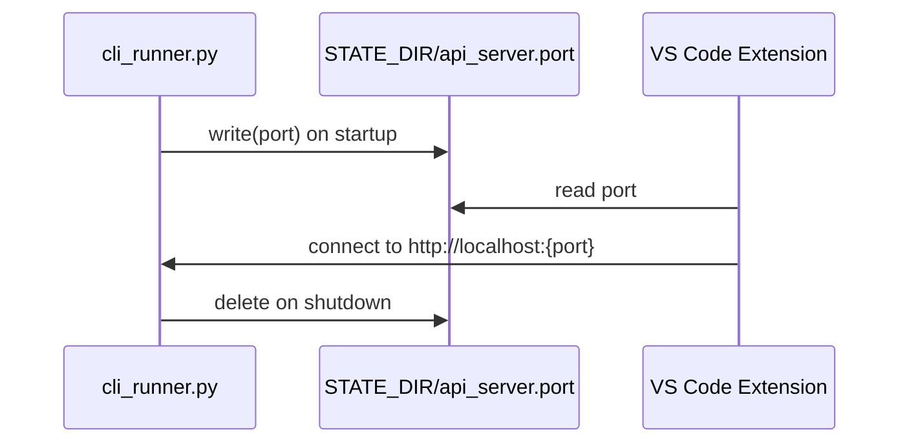
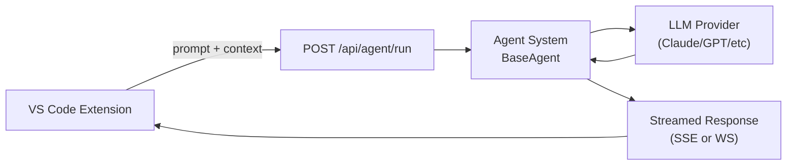

# Code Puppy — Gaps and Risks for VS Code Extension Integration

> **Purpose:** Identify what is missing, broken, or risky in the current
> code-puppy architecture specifically in the context of building a VS Code extension.
> Each gap includes its source evidence, severity, and the type of change needed.
>
> Read alongside: [`00-current-architecture.md`](./00-current-architecture.md)

---

## Sources

| File | What it evidences |
|------|------------------|
| [`code_puppy/cli_runner.py`](../../code_puppy/cli_runner.py) | Port selection — no persistence |
| [`code_puppy/http_utils.py`](../../code_puppy/http_utils.py) | `find_available_port()` — scans 8090–9010 |
| [`code_puppy/api/app.py`](../../code_puppy/api/app.py) | CORS `allow_origins=["*"]`, no auth middleware |
| [`code_puppy/api/websocket.py`](../../code_puppy/api/websocket.py) | No auth on PTY or events WebSocket |
| [`code_puppy/api/pty_manager.py`](../../code_puppy/api/pty_manager.py) | Shell spawned without any identity/scope constraints |
| [`code_puppy/plugins/frontend_emitter/emitter.py`](../../code_puppy/plugins/frontend_emitter/emitter.py) | WebSocket-only event delivery, no SSE |
| [`code_puppy/config.py`](../../code_puppy/config.py) | No port written to state directory |

**External references:**
- [RFC 6455 — WebSocket Protocol](https://datatracker.ietf.org/doc/html/rfc6455) — IETF
- [W3C Server-Sent Events](https://html.spec.whatwg.org/multipage/server-sent-events.html) — WHATWG
- [OWASP WebSocket Security](https://owasp.org/www-community/attacks/WebSocket_Security) — OWASP
- [OWASP REST Security Cheat Sheet](https://cheatsheetseries.owasp.org/cheatsheets/REST_Security_Cheat_Sheet.html) — OWASP
- [VS Code Extension Host API](https://code.visualstudio.com/api/references/vscode-api) — code.visualstudio.com

---

## Severity Legend

| Symbol | Severity | Meaning |
|--------|----------|---------|
| 🔴 | Critical | Blocks building the extension OR is a serious security risk |
| 🟡 | High | Significantly limits functionality or introduces meaningful risk |
| 🟢 | Medium | Noticeable limitation, workaround exists, should be addressed |

---

## Gap Summary

| # | Gap | Severity | Affects |
|---|-----|----------|---------|
| G1 | No port discovery mechanism | 🔴 | Extension cannot find the server |
| G2 | No authentication on any endpoint | 🔴 | Security — especially for remote use |
| G3 | Unauthenticated full shell via PTY | 🔴 | Security — critical for remote use |
| G4 | No SSE/HTTP fallback for events | 🟡 | Corporate network compatibility |
| G5 | CORS fully open (`*`) | 🟡 | Security for remote deployment |
| G6 | No TLS support | 🟡 | Security for remote deployment |
| G7 | No prompt submission API endpoint | 🔴 | Extension cannot send prompts to the agent |
| G8 | No VS Code context injection | 🟡 | Extension cannot share open file / selection |
| G9 | Event types not documented or typed | 🟢 | Extension cannot reliably consume events |
| G10 | Windows PTY requires optional dependency | 🟢 | Windows users may hit runtime errors |
| G11 | API server does not auto-start | 🔴 | Extension cannot connect without user action |
| G12 | No verbose/debug logging mode | 🔴 | Cannot debug connection issues during development |
| G13 | API server stdout/stderr discarded | 🔴 | Uvicorn logs silently thrown away — errors invisible |
| G14 | No `--debug` / `--log-level` CLI flag | 🟡 | No single switch to enable debug output |

---

## G1 — Port Discovery Is Unreliable (Port File Written Before Server Starts)

**Severity:** 🔴 Critical

**Evidence:**
```python
# cli_runner.py:151-158
available_port = find_available_port()     # scans 8090-9010, picks first free port
port_file = get_port_file_path()
port_file.write_text(str(available_port))  # ← written immediately at startup

# tools/browser/terminal_tools.py:316
async def start_api_server(port: int = 8765):
    ...  # server only starts when /api start is called — see G11
```

**Problem:** The port file (`~/.code_puppy/api_server.port`) is written at REPL
startup time, before any server is listening. The port recorded may differ from the
port the server actually uses when `/api start` is called (which defaults to 8765).
This means the port file is not a reliable signal that:
1. The server is running
2. The server is listening on the port in the file

Additionally, the port file is not deleted on clean shutdown if code-puppy is
force-killed, leaving a stale file that misleads the extension.

**Confirmed in practice:** `cat ~/.code_puppy/api_server.port` prints `8090`
(or similar). Running `/api start` starts the server on `8765`. The extension
reads the port file and tries `ws://127.0.0.1:8090/ws/terminal` — wrong port,
connection refused.

**Partial fix already in place:** `cli_runner.py` does write the port file. The
extension (`portDiscovery.ts`) reads it. But the two-step problem (file ≠ server
running, and file port ≠ server port) remains.

The `app.py` lifespan shutdown handler does delete the port file on clean shutdown
— but it never *updates* the file when the server actually starts.

**What needs to change in code-puppy:**
- Write the port file inside `start_api_server()` after uvicorn confirms it is listening, using the actual port (8765 or whatever was chosen)
- Delete the speculative write from `cli_runner.py` startup
- See G11 for the related auto-start issue



---

## G2 — No Authentication on Any Endpoint

**Severity:** 🔴 Critical (for remote), 🟢 Acceptable (for localhost-only)

**Evidence:**
```python
# app.py — no auth middleware present
app.add_middleware(TimeoutMiddleware, timeout=REQUEST_TIMEOUT)
app.add_middleware(CORSMiddleware, allow_origins=["*"], ...)
# ← no authentication middleware
```

**Problem:** Every REST endpoint and WebSocket connection is completely open.
Anyone who can reach the port can:
- Read all config values including API keys
- Execute any slash command
- List and read all session history
- Connect to the PTY terminal (see G3)

**For localhost-only:** Low risk — only processes on the same machine can connect.

**For remote/central deployment:** Unacceptable — any user on the network can
fully control the agent and read sensitive configuration.

**What needs to change:**
- Add optional API key authentication (e.g. `X-API-Key` header or Bearer token)
- Configurable via `puppy.cfg`: `api_auth_enabled = true`, `api_auth_token = <token>`
- Extension reads the token from the same config file and sends it with each request

---

## G3 — Unauthenticated Full Shell Access via PTY

**Severity:** 🔴 Critical (for remote), 🟡 High (even for localhost)

**Evidence:**
```python
# pty_manager.py:145
shell = shell or os.environ.get("SHELL", "/bin/bash")
pid, master_fd = pty.fork()
if pid == 0:
    os.execlp(shell, shell, "-i")   # ← interactive shell, no restrictions
```

```python
# websocket.py:57 — /ws/terminal handler
# No authentication check before creating PTY session
session = await manager.create_session(session_id=session_id, on_output=on_output)
```

**Problem:** Connecting to `ws://localhost:{port}/ws/terminal` immediately spawns
a full interactive shell (`/bin/bash -i` or equivalent) running as the same user
as the code-puppy process. There is:
- No authentication check
- No scope restriction on what the shell can do
- No audit logging of commands executed
- No session isolation between multiple clients

**Even on localhost:** Any other process or browser tab that can reach the port
gets a full shell. This is an OWASP A01 (Broken Access Control) issue.

**What needs to change:**
- Authentication required before PTY session creation (tied to G2)
- For remote deployment: consider whether PTY should be exposed at all, or
  restricted to local-only connections

---

## G4 — No SSE/HTTP Fallback for Events

**Severity:** 🟡 High

**Evidence:**
```python
# websocket.py:22 — only WebSocket delivery for events
@app.websocket("/ws/events")
async def websocket_events(websocket: WebSocket) -> None:
    ...

# emitter.py:22 — internal pub/sub uses asyncio.Queue
_subscribers: Set[asyncio.Queue[Dict[str, Any]]] = set()
# ← no HTTP response streaming path
```

**Problem:** The event stream (`/ws/events`) is WebSocket-only.

In **corporate environments**, WebSocket connections are frequently:
- Blocked by HTTP proxies that do not support the `Upgrade` header
- Terminated by deep-packet inspection appliances
- Dropped by load balancers without sticky-session configuration
- Flagged by compliance tools as uninspectable traffic

See [RFC 6455 §1.3](https://datatracker.ietf.org/doc/html/rfc6455#section-1.3) for
the WebSocket handshake requirements that proxies must support.

[Server-Sent Events (SSE)](https://html.spec.whatwg.org/multipage/server-sent-events.html)
is plain HTTP (`Content-Type: text/event-stream`) and passes through all standard
proxies and firewalls without special configuration.

**Comparison:**

| | WebSocket | SSE over HTTP |
|-|-----------|---------------|
| Direction | Bidirectional | Server → Client only |
| Proxy compatibility | Requires proxy support for `Upgrade` | Plain HTTP — universal |
| Load balancer | Requires sticky sessions | Stateless-friendly |
| Reconnection | Manual | Browser/client handles automatically |
| Corporate firewall | Often blocked | Passes through |
| Use case fit for events | Overkill | Perfect fit |

**What needs to change in code-puppy:**
Add a `GET /api/events/stream` SSE endpoint backed by the same `frontend_emitter`
queue. The extension detects local vs remote and chooses the transport:
- Local → WebSocket (lower latency, existing infrastructure)
- Remote → SSE (firewall-friendly)

---

## G5 — CORS Fully Open

**Severity:** 🟡 High (for remote), 🟢 Acceptable (for localhost)

**Evidence:**
```python
# app.py:98
app.add_middleware(
    CORSMiddleware,
    allow_origins=["*"],   # ← accepts requests from any origin
    allow_credentials=True,
    allow_methods=["*"],
    allow_headers=["*"],
)
```

**Problem:** With `allow_origins=["*"]`, any web page loaded in the browser can
make cross-origin requests to the code-puppy API. Combined with the lack of
authentication (G2), a malicious website could silently interact with the API
if a user has code-puppy running locally.

Note: `allow_credentials=True` with `allow_origins=["*"]` is actually invalid
per the [CORS spec](https://fetch.spec.whatwg.org/#cors-protocol-and-credentials)
— browsers will reject credentialed requests to wildcard origins. FastAPI/Starlette
should warn about this.

**What needs to change:**
- For localhost: `allow_origins=["http://localhost", "vscode-webview://*"]` — the
  VS Code webview uses the `vscode-webview://` scheme
- For remote: explicit allowlist of permitted origins

---

## G6 — No TLS Support

**Severity:** 🟡 High (for remote), 🟢 Not applicable (for localhost)

**Evidence:**
```python
# api/main.py:10
def main(host: str = "127.0.0.1", port: int = 8765) -> None:
    uvicorn.run(app, host=host, port=port)
    # ← no ssl_keyfile, ssl_certfile parameters
```

**Problem:** All traffic is plain HTTP (`http://`) and unencrypted WebSocket
(`ws://`). For localhost use this is fine — traffic never leaves the machine.
For remote/central deployment, all agent communication including prompts,
code, API keys in config, and terminal I/O would be transmitted in plaintext.

**What needs to change:**
- Add optional TLS configuration to `puppy.cfg`:
  `api_ssl_certfile`, `api_ssl_keyfile`
- Pass these to `uvicorn.run()` when configured
- Extension uses `https://` and `wss://` when connecting to remote instances

---

## G7 — No Prompt Submission API Endpoint

**Severity:** 🔴 Critical

**Evidence:**

Reviewing all REST endpoints in [`routers/`](../../code_puppy/api/routers/):
- `agents.py` — list agents only
- `commands.py` — execute slash commands only
- `sessions.py` — read/delete sessions only
- `config.py` — read/write config only

There is **no endpoint to submit a natural language prompt to the agent**.

The only way to send a prompt today is via:
1. The interactive REPL (stdin of the CLI process)
2. The PTY WebSocket (`/ws/terminal`) — which gives a full shell, not a structured API

**Problem:** The VS Code extension's core function — "send this prompt to the
agent, get a response" — has no structured API surface. The extension would be
forced to type into the PTY terminal and scrape the output, which is fragile and
unstructured.

**What needs to change in code-puppy:**
This is the most significant new endpoint needed:

```
POST /api/agent/run
{
  "prompt": "refactor this function to use async/await",
  "agent": "code-puppy",          // optional, uses current agent if omitted
  "context": {                     // optional VS Code context
    "file_path": "/src/foo.py",
    "selection": "def foo(): ...",
    "cursor_line": 42
  }
}
```

Response could be streaming (SSE or chunked) or request/response depending
on transport mode.



---

## G8 — No VS Code Context Injection

**Severity:** 🟡 High

**Problem:** Even if G7 is resolved with a prompt endpoint, the agent currently
has no way to receive VS Code-specific context:
- Which file is open
- What text is selected
- Where the cursor is
- What the workspace root is
- What language/framework is being used

Without this, the extension is just a chat panel — it cannot act as a true
coding assistant that understands what the developer is looking at.

**What needs to change:**
- The prompt endpoint (G7) should accept a `context` object
- code-puppy's agent system needs to inject this context into the system prompt
  or as a prepended message
- This likely involves a new callback hook: `load_vscode_context`

---

## G9 — Event Types Not Documented or Typed

**Severity:** 🟢 Medium

**Evidence:**
```python
# emitter.py:26
def emit_event(event_type: str, data: Any = None) -> None:
    # event_type is a free-form string
    # data is Any — no schema
```

**Problem:** The `/ws/events` stream emits events but there is no:
- Enumeration of possible `event_type` values
- Schema for the `data` payload per event type
- Documentation of what events are emitted and when

The extension cannot reliably parse or react to events without knowing what
to expect. This also makes the event contract fragile — any change to event
names or shapes silently breaks the extension.

**What needs to change:**
- Define an enum or constants for all `event_type` values
- Define Pydantic models for each event's `data` payload
- Document the event catalogue (can live in this docs folder)

---

## G10 — Windows PTY Requires Optional Dependency

**Severity:** 🟢 Medium

**Evidence:**
```python
# pty_manager.py:22
if IS_WINDOWS:
    try:
        import winpty
        HAS_WINPTY = True
    except ImportError:
        HAS_WINPTY = False   # ← silently degrades

# pty_manager.py:186
if not HAS_WINPTY:
    raise RuntimeError(
        "pywinpty is required for Windows terminal support. "
        "Install it with: pip install pywinpty"
    )
```

**Problem:** `pywinpty` is not listed as a dependency in
[`pyproject.toml`](../../pyproject.toml). Windows users who install code-puppy
will get a `RuntimeError` at the moment they try to use the PTY terminal — not
at install time. This is a poor user experience and will affect VS Code on Windows.

**What needs to change:**
- Add `pywinpty` as a conditional dependency for Windows in `pyproject.toml`
- Or surface the error earlier (at startup, not at connection time) with a
  clear install instruction

---

## G11 — API Server Does Not Auto-Start

**Severity:** 🔴 Critical

**Evidence:**
```python
# cli_runner.py:151-158 — port is chosen and file written at startup
available_port = find_available_port()
port_file = get_port_file_path()
port_file.write_text(str(available_port))   # ← written immediately, before server starts

# tools/browser/terminal_tools.py:316 — server only starts when /api start is called
async def start_api_server(port: int = 8765) -> str:
    ...
    subprocess.Popen(["uvicorn", "code_puppy.api.main:app", ...])
    # ← this is a tool, not called on startup
```

**Problem:** When the user runs `pup -i` or `uvx code-puppy -i`, the REPL starts
but the FastAPI/uvicorn server does **not**. The port file is written speculatively
— it records a port that was available at startup time, but nothing is listening on
that port yet.

The server only starts when the user explicitly types `/api start` inside the REPL.
This calls the `start_api_server` tool in `terminal_tools.py`, which spawns uvicorn
as a subprocess (defaulting to port **8765**, not the port in the file).

The result:
- The port file exists → the extension thinks it can connect
- Nothing is listening on that port → connection is refused
- The port in the file (e.g. `8090`) and the actual server port (`8765`) may differ

**Observed in practice:** Running `curl http://127.0.0.1:$(cat ~/.code_puppy/api_server.port)/docs`
returns empty / connection refused after `pup -i`, but succeeds after `/api start`.

**What needs to change in code-puppy:**

Option A (recommended) — auto-start the server as part of REPL startup in
`cli_runner.py`, and update the port file to reflect the actual port once
uvicorn is listening:

```python
# After REPL initialisation:
await start_api_server()           # start uvicorn
port_file.write_text(str(actual_port))  # update file with real port
```

Option B — do not write the port file until the server is actually listening,
and expose a `--api` flag or a config option to auto-start on launch.

Until this is fixed, the extension (and this setup guide) must instruct the
user to run `/api start` manually before launching the extension.

---

## G12 — No Verbose/Debug Logging Mode

**Severity:** 🔴 Critical (for development), 🟢 Not applicable (for production)

**Evidence:**
```python
# Dozens of modules follow this pattern:
logger = logging.getLogger(__name__)
logger.debug("Connecting to WebSocket at %s", url)
logger.info("Port file written: %s", port)
logger.warning("Stale PID file removed")

# But in cli_runner.py — no logging.basicConfig() call anywhere.
# Python's default logging level is WARNING.
# Result: all debug() and info() calls are silently discarded.
```

```python
# The only logging level that IS configurable:
"log_level": os.environ.get("DBOS_LOG_LEVEL", "ERROR")  # cli_runner.py:308
# This controls DBOS internals only — not code-puppy's own loggers.
```

**Problem:** code-puppy has `logger.debug()` and `logger.info()` calls throughout
its codebase (agent execution, WebSocket events, PTY sessions, port discovery,
MCP server lifecycle) but no logging configuration is ever set up. Python's root
logger defaults to WARNING level with no handlers, so all of this output is
silently dropped.

When the VS Code extension fails to connect, there is no log output anywhere
that shows:
- Why `portDiscovery.ts` failed to read the port file
- What the WebSocket connection attempt returned
- What happened inside `pty_manager.py` when the session was created
- What the API server received

**Current developer workaround:** None. You are debugging blind.

**What needs to change in code-puppy:**

Add logging setup in `cli_runner.py` controlled by an env var:

```python
import logging

log_level_name = os.environ.get("CODE_PUPPY_LOG_LEVEL", "WARNING").upper()
log_level = getattr(logging, log_level_name, logging.WARNING)
logging.basicConfig(
    level=log_level,
    format="%(asctime)s %(name)s %(levelname)s %(message)s",
    handlers=[
        logging.StreamHandler(sys.stderr),
        logging.FileHandler(os.path.join(STATE_DIR, "debug.log")),
    ]
)
```

This would enable:

```bash
CODE_PUPPY_LOG_LEVEL=DEBUG uvx code-puppy -i
# or in .env:
CODE_PUPPY_LOG_LEVEL=DEBUG
```

Until then, the only way to get any debug output is to insert `print()` statements
directly into the source and run from a dev install.

---

## G13 — API Server stdout/stderr Discarded

**Severity:** 🔴 Critical (for development)

**Evidence:**
```python
# tools/browser/terminal_tools.py:374
proc = subprocess.Popen(
    [sys.executable, "-m", "code_puppy.api.main"],
    stdout=subprocess.DEVNULL,   # ← all uvicorn output thrown away
    stderr=subprocess.DEVNULL,   # ← all errors thrown away
    start_new_session=True,
)
```

**Problem:** When `/api start` is called, uvicorn is launched as a detached
subprocess with both stdout and stderr routed to `/dev/null`. This means:

- Uvicorn access logs (every HTTP request, every WebSocket connection) are lost
- Uvicorn error output (startup failures, unhandled exceptions) is lost
- FastAPI application logs (`logger.info(...)` from `app.py`) are lost
- If the server crashes immediately after starting, there is no output at all

From the REPL you see `API server started (PID 16324)` — but if that process
dies 1 second later due to a port conflict, import error, or permission issue,
you will never know. The next `/api start` call will say "already running" based
on the PID file, pointing to a dead process.

**Confirmed in practice:** `lsof -i :8765` returning empty after a successful
`/api start` message would be the only visible symptom.

**What needs to change in code-puppy:**

Route uvicorn output to a log file instead of DEVNULL:

```python
log_file = Path(STATE_DIR) / "logs" / "api_server.log"
log_file.parent.mkdir(parents=True, exist_ok=True)

proc = subprocess.Popen(
    [sys.executable, "-m", "code_puppy.api.main"],
    stdout=open(log_file, "a"),
    stderr=subprocess.STDOUT,     # merge stderr into stdout
    start_new_session=True,
)
```

This would make the API server log available at `~/.code_puppy/logs/api_server.log`.
The file should be created at `0600` permissions (owner-only) since it may contain
request paths and headers.

**Developer workaround until fixed:** Run the server manually instead of via
`/api start`:

```bash
# In a separate terminal, with venv activated:
cd /Users/souvikmajumdar/pilots/sandbox/developer-experience/code_puppy
source .venv/bin/activate
python -m code_puppy.api.main
# Uvicorn logs now print to your terminal
```

---

## G14 — No `--debug` / `--log-level` CLI Flag

**Severity:** 🟡 High

**Evidence:**
```python
# cli_runner.py:56-93 — all argparse arguments defined here
parser.add_argument("--version", "-v", ...)
parser.add_argument("--interactive", "-i", ...)
parser.add_argument("--prompt", "-p", ...)
parser.add_argument("--agent", "-a", ...)
parser.add_argument("--model", "-m", ...)
# ← no --debug, --verbose, or --log-level argument
```

**Problem:** There is no CLI flag to enable debug output. The only logging knob
is `DBOS_LOG_LEVEL` (an env var that only affects DBOS internals, not code-puppy's
own loggers). Developers must set `CODE_PUPPY_LOG_LEVEL` (which doesn't exist yet
— see G12) via the environment, which requires either exporting it in the shell or
adding it to `.env`.

**What needs to change:**

Add a `--debug` flag and/or `--log-level` flag to `cli_runner.py`:

```python
parser.add_argument(
    "--debug",
    action="store_true",
    help="Enable debug logging (equivalent to --log-level DEBUG)",
)
parser.add_argument(
    "--log-level",
    choices=["DEBUG", "INFO", "WARNING", "ERROR"],
    default=os.environ.get("CODE_PUPPY_LOG_LEVEL", "WARNING"),
    help="Set logging level (default: WARNING)",
)
```

This would let developers do:

```bash
pup -i --debug
# or
pup -i --log-level INFO
```

**Developer workaround until fixed:** Set via environment variable in the
`.env` file (once G12 is implemented):

```bash
# extensions/vscode/.env
CODE_PUPPY_LOG_LEVEL=DEBUG
```

---

## Impact Matrix for VS Code Extension Phases

| Gap | Phase 1\nLocal PTY | Phase 2\nStructured API | Phase 3\nRemote Support |
|-----|--------------------|------------------------|------------------------|
| G1 Port discovery | 🔴 Must fix | 🔴 Must fix | 🔴 Must fix |
| G2 No auth | 🟢 Can defer | 🟢 Can defer | 🔴 Must fix |
| G3 PTY unauthed | 🟢 Can defer | 🟢 Can defer | 🔴 Must fix |
| G4 No SSE fallback | 🟢 Can defer | 🟢 Can defer | 🔴 Must fix |
| G5 CORS open | 🟢 Can defer | 🟡 Should fix | 🔴 Must fix |
| G6 No TLS | 🟢 Not needed | 🟢 Not needed | 🔴 Must fix |
| G7 No prompt API | 🟢 Use PTY | 🔴 Must fix | 🔴 Must fix |
| G8 No VS Code context | 🟢 Can defer | 🟡 Should fix | 🟡 Should fix |
| G9 Events untyped | 🟢 Can defer | 🟡 Should fix | 🟡 Should fix |
| G10 Windows PTY | 🟡 Should fix | 🟡 Should fix | 🟡 Should fix |
| G11 API server no auto-start | 🔴 Must fix | 🔴 Must fix | 🔴 Must fix |
| G12 No debug logging mode | 🔴 Must fix | 🟡 Should fix | 🟡 Should fix |
| G13 API server logs discarded | 🔴 Must fix | 🟡 Should fix | 🟡 Should fix |
| G14 No `--debug` flag | 🟡 Should fix | 🟢 Can defer | 🟢 Can defer |
