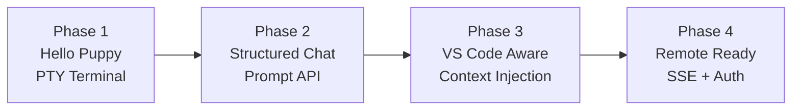
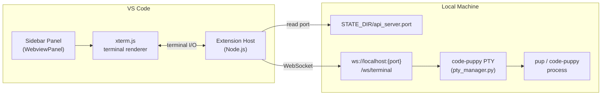
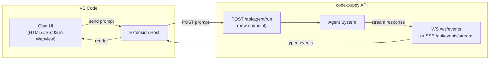
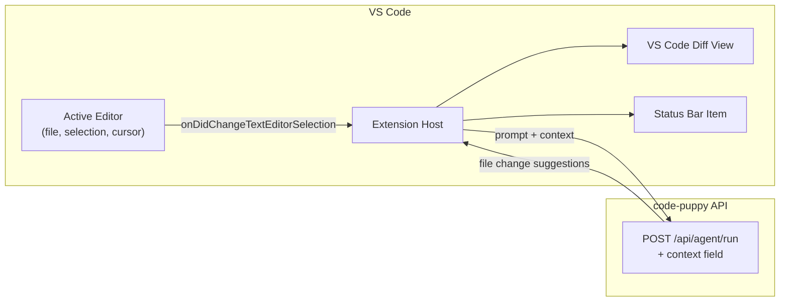
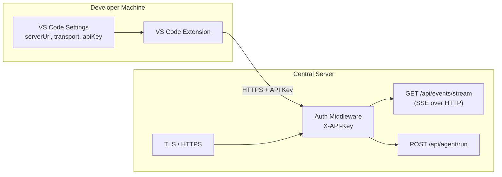
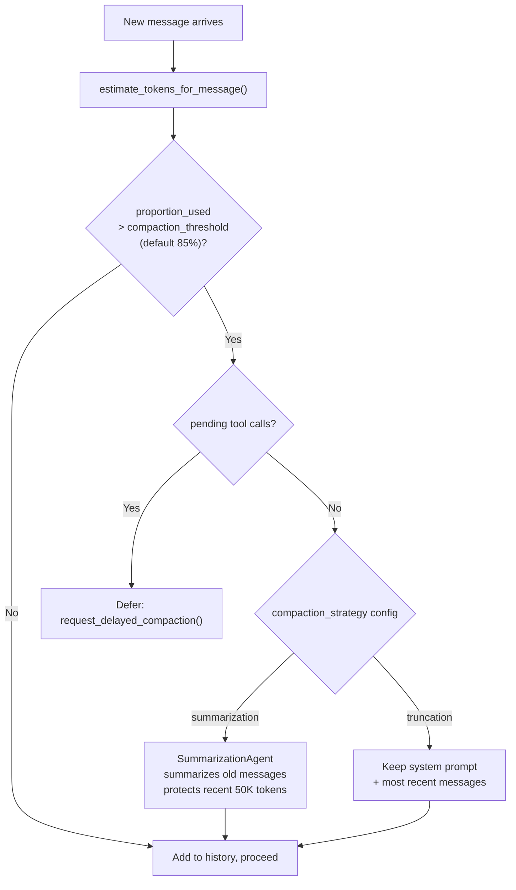

# Code Puppy VS Code Extension — Vision and Plan

> **Purpose:** Define what we are building, why, and how we will get there phase
> by phase. This is a living document — revisited and updated at the end of each
> phase based on what we learned.
>
> Read alongside:
> - [`00-current-architecture.md`](./00-current-architecture.md)
> - [`01-gaps-and-risks.md`](./01-gaps-and-risks.md)

---

## Sources and References

| Reference | URL |
|-----------|-----|
| VS Code Extension API | https://code.visualstudio.com/api |
| VS Code Webview API | https://code.visualstudio.com/api/extension-guides/webview |
| VS Code Extension Anatomy | https://code.visualstudio.com/api/get-started/extension-anatomy |
| Yeoman VS Code Generator | https://github.com/microsoft/vscode-generator-code |
| TypeScript Handbook | https://www.typescriptlang.org/docs/handbook/intro.html |
| xterm.js (terminal in browser) | https://xtermjs.org/ |
| FastAPI SSE with StreamingResponse | https://fastapi.tiangolo.com/advanced/custom-response/#streamingresponse |

---

## 1. Vision

**Build a VS Code extension that lets developers interact with code-puppy
directly inside their editor** — just like the Claude Code VS Code extension —
without leaving their IDE.

The extension will:
- Provide a **sidebar panel** with a chat interface to the code-puppy agent
- Be **aware of what the developer is looking at** — open file, selection, cursor
- Allow **agent and model switching** from within VS Code
- Eventually embed a **full interactive terminal** for raw code-puppy access
- Be designed from the start to work both **locally and remotely**

---

## 2. Guiding Principles

1. **Build iteratively** — each phase produces something usable, not just scaffolding
2. **Review before proceeding** — no phase starts without reviewing the previous one
3. **Docs stay current** — update this document and the architecture doc at each phase end
4. **Understand before building** — read code-puppy source before changing it
5. **Minimal changes to code-puppy** — only add what is needed for the current phase
6. **Security is layered in** — not bolted on at the end

---

## 3. Repository Structure

The extension lives inside the code-puppy repository on the `feature/vscode-extension`
branch, under a dedicated directory:

```
code_puppy/                          ← repo root
├── code_puppy/                      ← Python source (unchanged)
├── extensions/
│   └── vscode/                      ← VS Code extension (TypeScript/Node.js)
│       ├── src/                     ← Extension source code
│       ├── package.json             ← Extension manifest
│       ├── tsconfig.json
│       └── README.md
├── docs/
│   └── vscode-extension/            ← Planning docs (this folder)
│       ├── 00-current-architecture.md
│       ├── 01-gaps-and-risks.md
│       └── 02-vision-and-plan.md    ← This file
└── pyproject.toml
```

**Why inside the repo:** During active development, coordinated changes to both
code-puppy (Python) and the extension (TypeScript) happen together. Keeping them
in the same repo and branch makes this easier to manage. Can be extracted to its
own repo when it matures.

---

## 4. Phased Roadmap



Each phase has:
- A clear **goal** — what the user can do at the end
- **code-puppy changes** required (from gaps doc)
- **Extension work** required
- **Review checkpoint** before moving on

---

## 5. Phase 1 — "Hello Puppy"

**Goal:** A VS Code panel with a real embedded terminal running code-puppy.
The developer can type prompts and get responses, exactly as if using the CLI —
but without leaving VS Code.

### What the user experiences
- Open VS Code → click the Code Puppy icon in the sidebar
- A terminal panel appears with the code-puppy REPL running inside it
- Type prompts, get responses, switch agents with `/agent` — everything the CLI supports

### How it works



### code-puppy changes required (from gaps doc)

| Gap | Change |
|-----|--------|
| **G1** — No port discovery | Write port to `{STATE_DIR}/api_server.port` at startup, delete on shutdown |

That's it for Phase 1. No other code-puppy changes needed.

### Extension work

1. Scaffold VS Code extension with `yo code` (TypeScript, no webpack)
2. Register a sidebar `WebviewPanel`
3. Read the port file to discover code-puppy's port
4. Connect to `/ws/terminal` via WebSocket
5. Embed [xterm.js](https://xtermjs.org/) in the webview for terminal rendering
6. Pipe WebSocket output → xterm.js display
7. Pipe xterm.js keystrokes → WebSocket input
8. Handle terminal resize (VS Code panel resize → send `resize` message)
9. Handle code-puppy not running — show a "Start code-puppy first" message

### Phase 1 Review Checklist
- [x] Terminal renders correctly inside VS Code
- [x] Can type a prompt and receive a response
- [x] `/agent`, `/model`, `/help` slash commands work
- [x] Terminal resize works when panel is resized (debounced)
- [x] Graceful message when code-puppy is not running

---

## 6. Phase 2 — "Structured Chat"

**Goal:** Replace the raw terminal with a proper chat UI. Messages from the agent
are rendered as structured cards (not raw terminal output). The developer can send
prompts via an input box.

### What the user experiences
- Clean chat interface: user messages on the right, agent responses on the left
- Agent responses rendered as markdown with syntax-highlighted code blocks
- A "thinking..." indicator while the agent is working
- Agent and model selector dropdowns in the panel header

### How it works



### code-puppy changes required

| Gap | Change |
|-----|--------|
| **G7** — No prompt API | Add `POST /api/agent/run` endpoint |
| **G9** — Events untyped | Define event type enum + Pydantic schemas for event payloads |

### Extension work

1. Build chat UI in the webview (HTML/CSS/TypeScript)
2. Message input box + send button
3. Connect to `/ws/events` for streaming agent responses
4. Render agent responses as markdown (use a lightweight renderer)
5. Call `GET /api/agents/` to populate agent selector
6. Call `/api/config/` to populate model selector
7. Show typing indicator on `agent_run_start` event
8. Clear indicator on `agent_run_end` event

### Phase 2 Review Checklist
- [ ] Chat UI renders cleanly in the sidebar
- [ ] Prompt sent, response received and rendered as markdown
- [ ] Code blocks syntax highlighted
- [ ] Agent switcher works
- [ ] Model switcher works
- [ ] Typing indicator appears and disappears correctly

---

## 7. Phase 3 — "VS Code Aware"

**Goal:** The agent knows what the developer is looking at. Prompts are
automatically enriched with the active file, selected text, and cursor position.
File changes suggested by the agent can be previewed as inline diffs.

### What the user experiences
- Select some code → ask "refactor this" → agent already has the code as context
- Agent suggests file changes → VS Code diff view opens showing before/after
- Click a file reference in the agent's response → jumps to that file in the editor
- Status bar shows current agent and model

### How it works



### code-puppy changes required

| Gap | Change |
|-----|--------|
| **G8** — No context injection | `POST /api/agent/run` accepts `context` object; agent prepends it to prompt |

### Extension work

1. Listen to `vscode.window.onDidChangeActiveTextEditor`
2. Listen to `vscode.window.onDidChangeTextEditorSelection`
3. Attach context (file path, language, selection, cursor line) to every prompt
4. Parse file references from agent responses — make them clickable links
5. When agent proposes file edits, open VS Code diff view via `vscode.diff()`
6. Add status bar item showing current agent + model
7. Clicking status bar item opens agent/model quick picker

### Phase 3 Review Checklist
- [ ] Selected text automatically included in prompt context
- [ ] Agent can reference the correct file and line numbers
- [ ] File references in responses are clickable
- [ ] Proposed file changes open in VS Code diff view
- [ ] Status bar shows correct agent and model
- [ ] Status bar click opens quick picker

---

## 8. Phase 4 — "Remote Ready"

**Goal:** The extension works when code-puppy is running on a remote or central
server, not just on the local machine. Corporate network compatibility addressed.

### What the user experiences
- Configure a remote code-puppy server URL in VS Code settings
- Extension automatically uses SSE instead of WebSocket when connecting remotely
- API key authentication for remote connections
- No raw PTY terminal exposed on remote instances

### How it works



### code-puppy changes required

| Gap | Change |
|-----|--------|
| **G2** — No auth | Optional API key middleware, configurable in `puppy.cfg` |
| **G4** — No SSE fallback | Add `GET /api/events/stream` SSE endpoint |
| **G5** — CORS open | Configurable `allowed_origins` in `puppy.cfg` |
| **G6** — No TLS | Optional TLS config (`ssl_certfile`, `ssl_keyfile`) in `puppy.cfg` |

### Extension work

1. Add VS Code settings: `codePuppy.serverUrl`, `codePuppy.transport`, `codePuppy.apiKey`
2. Transport detection: WebSocket for localhost, SSE for remote (or user override)
3. Attach `X-API-Key` header to all requests when configured
4. Use `https://` and `wss://` when connecting to non-localhost URLs
5. Connection status indicator (connected / disconnected / error)
6. Settings UI walkthrough for first-time remote setup

### Phase 4 Review Checklist
- [ ] Extension connects to a remote code-puppy instance
- [ ] API key authentication works end-to-end
- [ ] SSE transport works through a proxy/firewall
- [ ] TLS connections work (`wss://`, `https://`)
- [ ] `codePuppy.transport = "auto"` correctly selects WebSocket vs SSE

---

## 9. What We Are NOT Building (Right Now)

To keep scope clear, these are explicitly out of scope for the initial phases:

- **Inline code completions** (like Copilot suggestions) — different VS Code API surface
- **Diff editor integration beyond viewing** — auto-applying patches is Phase 4+
- **Multi-root workspace support** — single workspace root for now
- **Extension marketplace publishing** — internal/dev use first
- **Windows-specific testing** — G10 (pywinpty) deferred to later

---

## 10. Decision Log

Decisions made during planning that future phases should not re-litigate without
good reason:

| Decision | Rationale | Date |
|----------|-----------|------|
| Extension lives in `extensions/vscode/` inside the code-puppy repo | Easier coordination during active dev; can extract later | 2026-03-13 |
| Phase 1 uses PTY terminal (not chat UI) | Gets something working fast; teaches the codebase; chat UI in Phase 2 | 2026-03-13 |
| xterm.js for terminal rendering | Industry standard; used by VS Code's own terminal; well-maintained | 2026-03-13 |
| Transport: WebSocket local, SSE remote | WebSocket suits localhost; SSE is firewall-friendly for corporate remote use | 2026-03-13 |
| No commits without explicit instruction | User preference — full control over git history | 2026-03-13 |
| Did not look at `dag-sidebar` or `web-puppy` branches | Learning exercise — build first, compare later | 2026-03-13 |

---

## 11. Phase Completion Log

> Updated at the end of each phase. Current status: **Phase 1 complete.**

| Phase | Status | Notes |
|-------|--------|-------|
| Phase 1 — Hello Puppy | ✅ Complete (2026-03-16) | PTY terminal in sidebar, connects to `/ws/puppy`, spawns `pup -i`. Unicode fixed. Resize debounced. API key reads from `puppy.cfg`. Known gaps: G1 (port file), G11 (manual server start). |
| Phase 2 — Structured Chat | 🔲 Not started | |
| Phase 3 — VS Code Aware | 🔲 Not started | |
| Phase 4 — Remote Ready | 🔲 Not started | |

---

## 12. Context Management Strategy

> This section covers how context window limits are handled — both inside
> code-puppy (which we largely inherit for free) and in the extension itself
> (which we must design deliberately).

**Sources:**
- [`code_puppy/agents/base_agent.py`](../../code_puppy/agents/base_agent.py) — `message_history_processor()`, `summarize_messages()`, `truncation()`
- [`code_puppy/summarization_agent.py`](../../code_puppy/summarization_agent.py) — dedicated summarization agent
- [`code_puppy/session_storage.py`](../../code_puppy/session_storage.py) — session persistence
- [`code_puppy/config.py`](../../code_puppy/config.py) — `get_compaction_threshold()`, `get_compaction_strategy()`, `get_protected_token_count()`

---

### 12.1 What code-puppy already handles (no action needed from us)

code-puppy has a sophisticated in-session context management system:



| Feature | Detail |
|---------|--------|
| Context limit detection | Reads model max from `models.json` (default 128K tokens) |
| Token estimation | `len(text) / 2.5` heuristic — fast, ~10-30% inaccurate |
| Compaction threshold | Configurable, default 85% of context window |
| Summarization | Dedicated `SummarizationAgent` summarizes oldest messages |
| Protected zone | Most recent 50K tokens never summarized |
| Tool call safety | Won't compact mid-tool-execution — defers until safe |
| Truncation fallback | Simpler strategy: keep system prompt + recent N tokens |
| Session persistence | Full history pickled to `~/.code_puppy/subagent_sessions/` |
| Session restore | Interactive restore offered on next startup |

The extension inherits all of this for free — **we do not need to re-implement
in-session context management.**

---

### 12.2 Extension display context (Phase 2 concern)

The chat UI webview accumulates rendered messages. As the conversation grows:
- The webview DOM becomes large and slow to re-render
- The user loses track of where the conversation started

**Strategy for Phase 2:**
- Use a **virtualised message list** — only render messages currently visible in
  the viewport, not the entire history
- Provide a **"Clear conversation"** button that starts a fresh session
- Show a subtle indicator when code-puppy has compacted context
  (listen for a `context_compacted` event type on `/ws/events`)

---

### 12.3 VS Code context injection size (Phase 3 concern)

When injecting the active file and selection into every prompt, a large file
could consume a significant fraction of the context window before the user
has even typed their question.

**Strategy for Phase 3:**
- **Cap injected file content** to a configurable window around the cursor
  (default: 100 lines above + 100 lines below cursor position)
- **Cap selection injection** at a maximum of 500 lines — if selection is larger,
  warn the user and ask them to narrow it
- **Never inject the full file** unless it is under a size threshold (e.g. < 200 lines)
- Expose these limits as VS Code settings:
  `codePuppy.contextLines` (default: 100), `codePuppy.maxSelectionLines` (default: 500)

---

### 12.4 Project memory / summary directory (Phase 4+ enhancement)

For complex, long-running projects, important decisions and context made in
early sessions are lost once those sessions are compacted or discarded. This is
a gap in code-puppy itself, not just the extension.

**The problem:**
```
Session 1: "Set up project architecture — FastAPI + PostgreSQL, JWT auth, AWS"
    → compacted → key decisions lost

Session 10: "Debug billing issue"
    → agent has no memory of the architecture decisions
    → has to re-discover the stack from scratch
```

**Proposed solution: project-scoped memory file**

Similar to how Claude Code uses `CLAUDE.md`, code-puppy could maintain a
`~/.code_puppy/projects/{project_hash}/memory.md` that:
- Is automatically appended to by `SummarizationAgent` at compaction time
- Contains distilled project facts: stack, conventions, key decisions
- Is injected into the system prompt at the start of each new session
- Can be manually edited by the developer to add/correct facts

**Scope:** This is a code-puppy enhancement, not an extension feature. The
extension would surface it (e.g. a "Project Memory" view in the sidebar) but the
logic lives in code-puppy.

**Phase placement:** Designed in Phase 3, implemented in Phase 4+.

**Added to gaps doc:** This will be tracked as **G11** in
[`01-gaps-and-risks.md`](./01-gaps-and-risks.md).
