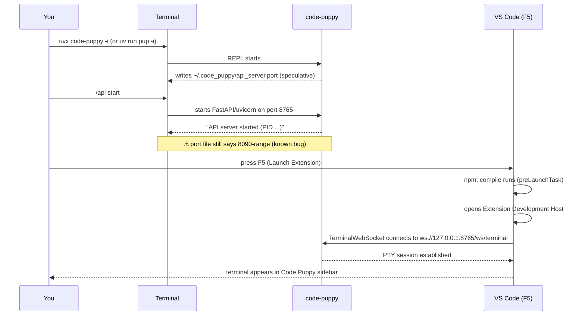

# code-puppy Setup Guide

This guide covers everything needed to get code-puppy running locally so the
VS Code extension can connect to it. It starts from zero — no assumptions about
existing Python tooling.

**Sources:**
| Topic | Source |
|---|---|
| uv installer | https://docs.astral.sh/uv/getting-started/installation/ |
| uvx (tool runner) | https://docs.astral.sh/uv/concepts/tools/ |
| pyenv | https://github.com/pyenv/pyenv |
| Python version support | `pyproject.toml` → `requires-python = ">=3.11,<3.14"` |
| Anthropic API keys | https://console.anthropic.com/ |
| OpenAI API keys | https://platform.openai.com/api-keys |
| Google/Gemini API keys | https://aistudio.google.com/apikey |

---

## 1. Why uv / uvx?

code-puppy is published on PyPI and its recommended install method is `uvx`.

**uv** is a fast Python package and project manager (written in Rust) that
replaces `pip`, `pip-tools`, `virtualenv`, and `pyenv` for most workflows.
**uvx** is uv's tool runner — it installs and runs a Python CLI tool in an
isolated environment in a single command, without you having to create a
virtual environment manually.

```
uvx code-puppy
```

This one command: downloads code-puppy from PyPI (if not cached), creates a
temporary isolated environment, and runs it. Nothing is installed globally.

For development (working from source), uv also manages the virtual environment
and dependencies, replacing `python -m venv` + `pip install`.

---

## 2. Prerequisites

### 2.1 Python 3.11–3.13

code-puppy requires Python 3.11, 3.12, or 3.13 (`pyproject.toml`:
`requires-python = ">=3.11,<3.14"`).

Check what you have:

```bash
python3 --version
```

If you need to install or upgrade Python, the cleanest approach on macOS is
**pyenv** (manages multiple Python versions side-by-side):

```bash
# Install pyenv via Homebrew
brew install pyenv

# Add to ~/.zshrc (run once)
echo 'export PYENV_ROOT="$HOME/.pyenv"' >> ~/.zshrc
echo '[[ -d $PYENV_ROOT/bin ]] && export PATH="$PYENV_ROOT/bin:$PATH"' >> ~/.zshrc
echo 'eval "$(pyenv init -)"' >> ~/.zshrc
source ~/.zshrc

# Install Python 3.13 (latest supported)
pyenv install 3.13
pyenv global 3.13       # set as default, or use pyenv local 3.13 per project

# Verify
python3 --version       # should print Python 3.13.x
```

> **Do you need pyenv if you already have Python 3.11+?**
> No. uv manages its own Python installations and can download the right
> version automatically. If `python3 --version` already shows 3.11–3.13,
> you can skip this section.

### 2.2 uv

There are two ways to install uv on macOS. Both work, but they differ in
important ways:

| | Astral installer (curl) | Homebrew |
|---|---|---|
| Binary | Prebuilt by Astral | Compiled from source on your machine |
| Install speed | Fast | Slower (requires Rust compile) |
| `uv self update` | **Works** | **Disabled** — use `brew upgrade uv` |
| Shell profile | Auto-adds `~/.local/bin` to PATH | No change (uses Homebrew prefix) |
| Maintained by | Astral (the uv authors) | Homebrew community |

**Recommendation:** Use the Astral installer if you want `uv self update` to work and the latest version on the day of install. Use Homebrew if you already `brew upgrade` everything and prefer one tool to manage updates.

#### Option A — Astral installer (recommended by uv docs)

```bash
curl -LsSf https://astral.sh/uv/install.sh | sh
```

This installs `uv` and `uvx` to `~/.local/bin` and automatically adds that
directory to your PATH by modifying `~/.zshrc`. Reload your shell:

```bash
source ~/.zshrc
```

Self-update at any time:

```bash
uv self update
```

#### Option B — Homebrew

```bash
brew install uv
```

Homebrew compiles uv from source (slower first install). The binary lands in
`/opt/homebrew/bin/uv` (Apple Silicon) which is already in PATH from your
Homebrew setup.

**Important:** `uv self update` does **not** work for Homebrew-managed installs.
uv detects it is managed and refuses. Use `brew upgrade uv` instead — Homebrew
will not warn you about this on its own.

#### Verify either install

```bash
uv --version
uvx --version
```

**Reference:** https://docs.astral.sh/uv/getting-started/installation/

---

## 3. Running code-puppy with uvx (quickest path)

Use this if you want to run code-puppy from its published PyPI package without
touching the source code. `uvx` downloads the package, creates a temporary
isolated environment, and runs it — no manual `venv` or `pip install` needed.

**You can run `uvx code-puppy` from any directory.** uvx does not care about
your current working directory; it fetches the package from PyPI.

### Step 1 — First run

```bash
uvx code-puppy
```

The very first time you run this, uvx will:
1. Download code-puppy and all its dependencies from PyPI into a local cache
   (`~/.cache/uv/` by default)
2. Create an isolated virtual environment for it
3. Start code-puppy

Subsequent runs are instant — uvx reuses the cached environment.

### Step 2 — What you will see on first launch

code-puppy starts an onboarding wizard. It will ask you to:
- Accept the privacy policy
- Set up an API key (Anthropic by default)
- Configure a default model

If you have already set API keys (see Section 5), you can skip the wizard:

```bash
CODE_PUPPY_SKIP_TUTORIAL=1 uvx code-puppy
```

### Step 3 — Interactive mode

The `-i` flag starts code-puppy in fully interactive REPL mode, which is what
you want for day-to-day use and for VS Code extension development:

```bash
uvx code-puppy -i
```

You will see the code-puppy prompt. The REPL is running, but **the API server
does not start automatically**. You must start it explicitly:

```
/api start
```

You will see output like:

```
Starting API server on http://127.0.0.1:8765 ...
API server started (PID 16324)
Docs available at http://127.0.0.1:8765/docs
```

Leave this terminal running. The VS Code extension connects to the API server
over WebSocket.

> **Port mismatch (known bug):** `/api start` starts uvicorn on port **8765**
> (hardcoded default in `terminal_tools.py`). But the port file
> (`~/.code_puppy/api_server.port`) is written at REPL startup with whatever
> port `find_available_port()` found in the 8090–9010 range — a different value.
> The extension reads the port file, so it will try to connect to the wrong port.
> Until this is fixed upstream, use port **8765** directly for the API server.
> See the Troubleshooting section for the workaround.

### Step 4 — Verify the API server started

Open a second terminal. The **correct** verification is to check both the port
file **and** that something is actually listening on that port. The port file
alone is not sufficient — a stale file from a previous session that crashed
or was force-killed will pass the file check but fail the connection check.

**Check 1 — port file exists:**

```bash
cat ~/.code_puppy/api_server.port
# Expected: a single port number, e.g. 8090
```

**Check 2 — something is actually listening on that port:**

```bash
lsof -i :$(cat ~/.code_puppy/api_server.port)
# Expected: a line showing a Python process on that port
# If output is empty → stale port file (see below)
```

**Check 3 — the API server responds:**

```bash
curl -s http://127.0.0.1:$(cat ~/.code_puppy/api_server.port)/docs | head -5
# Expected: HTML from the FastAPI auto-generated docs page
```

> The `/health` endpoint does not exist in the current version of code-puppy.
> Use `/docs` (FastAPI's built-in docs UI) as a liveness check instead.

#### Stale port file

If the port file exists but `lsof` shows nothing listening, the file is stale
— left behind by a previous code-puppy process that crashed or was
force-killed without running its shutdown handler.

Fix:

```bash
rm ~/.code_puppy/api_server.port
```

Then start code-puppy again. It will write a fresh port file on startup.

---

## 4. Development install (working from source)

Use this path when you are actively making changes to code-puppy itself
alongside the VS Code extension — for example, adding or modifying API
endpoints, fixing the port-file logic, or debugging PTY behaviour.

### Step 1 — Navigate to the repo root

The repo for this project lives at:

```
/Users/souvikmajumdar/pilots/sandbox/developer-experience/code_puppy/
```

```bash
cd /Users/souvikmajumdar/pilots/sandbox/developer-experience/code_puppy
```

Everything from here runs from this directory. Do **not** `cd` into
`code_puppy/` (the Python package subdirectory) or `extensions/vscode/` —
uv needs to be at the repo root where `pyproject.toml` and `uv.lock` live.

```
developer-experience/code_puppy/    ← you must be here
├── pyproject.toml                  ← uv reads this for dependencies
├── uv.lock                         ← exact locked versions (reproducible)
├── code_puppy/                     ← Python package source
└── extensions/vscode/              ← VS Code extension source
```

### Step 2 — Create the virtual environment and install dependencies

```bash
uv sync
```

`uv sync` reads `pyproject.toml` and `uv.lock` and does three things:
1. Selects a compatible Python version (3.11–3.13, from your system or uv's
   managed versions)
2. Creates `.venv/` in the repo root
3. Installs all dependencies at the exact versions locked in `uv.lock`

This is reproducible — every developer running `uv sync` on this repo gets
the exact same package versions. It is the equivalent of:

```bash
python3 -m venv .venv
source .venv/bin/activate
pip install -e ".[dev]"
```

...but faster and without the possibility of version drift.

You should see output like:

```
Resolved 87 packages in 0.42s
Installed 87 packages in 3.1s
 + anthropic==0.79.0
 + code-puppy==0.0.430
 + fastapi>=0.109.0
 ...
```

### Step 3 — Activate the virtual environment

```bash
source .venv/bin/activate
```

Your prompt will change to show `(.venv)` at the start. All `python` and
`pip` commands now use the project's isolated environment, not your system
Python.

To deactivate later:

```bash
deactivate
```

### Step 4 — Verify the install

```bash
# Check the installed version
pup --version
# or equivalently:
python -m code_puppy --version
```

`pup` is the short alias for `code-puppy` defined in `pyproject.toml`:

```toml
[project.scripts]
code-puppy = "code_puppy.main:main_entry"
pup        = "code_puppy.main:main_entry"
```

Both names run the same entry point.

### Step 5 — Start code-puppy from source

With the venv activated (from Step 3):

```bash
pup -i
```

Without activating the venv (uv handles it):

```bash
uv run pup -i
```

`uv run` is useful in scripts or when you don't want to think about
activating/deactivating — it executes the command inside the project's venv
automatically, regardless of which directory you are in or what your shell's
active Python is.

### Step 6 — Verify the API server started

Same three checks as Section 3, Step 4:

```bash
# In a second terminal:
cat ~/.code_puppy/api_server.port                         # port file exists?
lsof -i :$(cat ~/.code_puppy/api_server.port)             # process listening?
curl -s http://127.0.0.1:$(cat ~/.code_puppy/api_server.port)/docs | head -5  # server responds?
```

If `lsof` returns empty, the port file is stale — `rm ~/.code_puppy/api_server.port` and restart.

### When to re-run `uv sync`

Run `uv sync` again whenever:
- You pull new commits that change `pyproject.toml` or `uv.lock`
- You add a new dependency to `pyproject.toml` yourself
- Your `.venv/` directory gets deleted or corrupted

You do **not** need to re-run it just because you edited Python source files —
the package is installed in editable mode (`-e`), so source changes are
reflected immediately without reinstalling.

---

## 5. API key setup

code-puppy supports multiple AI providers. You need at least one key.

### Where code-puppy stores keys

code-puppy has two ways to read API keys, checked in this order:

1. **Environment variable** — e.g. `export ANTHROPIC_API_KEY=sk-ant-...`
2. **Config file** — `~/.code_puppy/puppy.cfg` (or `$XDG_CONFIG_HOME/code_puppy/puppy.cfg`)

The config file approach is more convenient for day-to-day use since keys
persist across terminal sessions without needing to `export` them each time.

### Setting keys via the code-puppy CLI (recommended)

Start code-puppy once and use the `/set` command:

```bash
uvx code-puppy -i
# Inside the REPL:
/set ANTHROPIC_API_KEY=sk-ant-...
/set OPENAI_API_KEY=sk-...
/set GEMINI_API_KEY=AIza...
```

This writes the keys to `~/.code_puppy/puppy.cfg` and they persist for all
future sessions.

### Setting keys via environment variables

Add to `~/.zshrc` (or `~/.bashrc`):

```bash
export ANTHROPIC_API_KEY="sk-ant-..."
export OPENAI_API_KEY="sk-..."
export GEMINI_API_KEY="AIza..."
```

Then reload:

```bash
source ~/.zshrc
```

### Provider key reference

| Provider | Env var | Where to get the key |
|---|---|---|
| Anthropic (Claude) | `ANTHROPIC_API_KEY` | https://console.anthropic.com/ — Settings → API Keys |
| OpenAI (GPT / o-series) | `OPENAI_API_KEY` | https://platform.openai.com/api-keys |
| Google (Gemini) | `GEMINI_API_KEY` | https://aistudio.google.com/apikey |
| Google (alias) | `GOOGLE_API_KEY` | Same as above — either name works |
| Azure OpenAI | `AZURE_OPENAI_API_KEY` + `AZURE_OPENAI_ENDPOINT` | Azure Portal → Your OpenAI resource → Keys |
| OpenRouter | `OPENROUTER_API_KEY` | https://openrouter.ai/keys |
| Cerebras | `CEREBRAS_API_KEY` | https://cloud.cerebras.ai/ |

> **Which key do I need?**
> You only need one to get started. Anthropic (Claude) is the default model
> in code-puppy. If you want to use Gemini or GPT models, add those keys too.

### Verifying keys are configured

```bash
uvx code-puppy -i
# Inside the REPL:
/config
```

This shows which keys are set and which providers are available.

---

## 6. Starting code-puppy for VS Code extension development

The VS Code extension connects to code-puppy's embedded API server over
WebSocket. The server is **not** started automatically when code-puppy starts.
You must start it with `/api start` inside the REPL.

When code-puppy first launches it does write a port file:

```
~/.code_puppy/api_server.port
```

...but this file is written speculatively (before the server is up). It
records a port that was available at startup time. The extension reads this
file via `portDiscovery.ts`, so it is important that:

1. code-puppy is running, **and**
2. `/api start` has been called, **and**
3. The server is actually listening on the port in the file

### Start code-puppy (installed via uvx)

```bash
uvx code-puppy -i
```

Then at the `pup>` prompt:

```
/api start
```

### Start code-puppy (from source)

```bash
# From the repo root, with venv activated:
pup -i
# or without activating:
uv run pup -i
```

Then at the `pup>` prompt:

```
/api start
```

### Verify the API server is reachable

```bash
# Check which port the extension will try to use
cat ~/.code_puppy/api_server.port

# Confirm something is listening on that port
lsof -i :$(cat ~/.code_puppy/api_server.port)

# Confirm the server responds (no /health endpoint — use /docs)
curl -s http://127.0.0.1:$(cat ~/.code_puppy/api_server.port)/docs | head -5
# Expected: HTML from the FastAPI auto-generated docs page
```

---

## 7. Full startup sequence for VS Code development

This is the recommended order of operations when working on the extension:



**Step 1:** Start code-puppy in a terminal:

```bash
uvx code-puppy -i   # or: uv run pup -i (from source)
```

**Step 2:** At the `pup>` prompt, start the API server:

```
/api start
```

Wait for `API server started (PID ...)` before continuing.

**Step 3:** Open the repo in VS Code (the workspace root, not
`extensions/vscode/`).

**Step 4:** Make sure npm dependencies are installed (first time only):

```bash
cd extensions/vscode
npm install
```

**Step 5:** Press F5 (or Run → Start Debugging → "Launch Extension").

**Step 6:** In the Extension Development Host window that opens, click the
Code Puppy icon in the activity bar (left sidebar). The terminal should appear
and show `● connected to code-puppy`.

---

## 8. Troubleshooting

### "Port file not found" or connection refused in the extension

Three possible causes:

**A — code-puppy is not running.** Start it (`uvx code-puppy -i`) and wait for
the `pup>` prompt, then run `/api start` and verify:

```bash
cat ~/.code_puppy/api_server.port
lsof -i :$(cat ~/.code_puppy/api_server.port)
curl -s http://127.0.0.1:$(cat ~/.code_puppy/api_server.port)/docs | head -5
```

**B — code-puppy is running but `/api start` was not called.** The port file
exists (written speculatively at startup) but the server is not listening.
At the `pup>` prompt:

```
/api start
```

**C — Stale port file from a previous crashed session.** The file exists but
nothing is listening on that port. This happens when code-puppy is force-killed
(`kill -9`) or crashes before the shutdown handler runs:

```bash
lsof -i :$(cat ~/.code_puppy/api_server.port)
# empty output → stale file

rm ~/.code_puppy/api_server.port
# restart code-puppy, then run /api start
```

### Port mismatch: port file shows wrong port

`cli_runner.py` writes the port file at REPL startup using `find_available_port()`
(scans 8090–9010). But `/api start` starts uvicorn on port **8765** (its own
hardcoded default) — a completely different port. The extension reads the port file
and tries to connect to the 8090-range port, but the server is actually on 8765.

This is a known gap (G11 in `01-gaps-and-risks.md`). Until it is fixed in
code-puppy, verify the actual server port directly:

```bash
# What the port file says (may be wrong)
cat ~/.code_puppy/api_server.port

# What is actually listening (use this port)
lsof -i :8765
curl -s http://127.0.0.1:8765/docs | head -5
```

The extension's `portDiscovery.ts` reads the port file. Until code-puppy is fixed
to write the correct port, you may need to temporarily edit `portDiscovery.ts` to
hardcode `8765` for local development.

### How to get verbose debug output (current workarounds)

code-puppy has no debug logging mode today — this is a documented gap (G12–G14
in `01-gaps-and-risks.md`). Here is what you can do right now:

**Workaround 1 — Run the API server manually (reveals uvicorn logs)**

Instead of `/api start` (which discards all output), run uvicorn directly in a
separate terminal. This shows every HTTP request, WebSocket connection, error,
and startup message:

```bash
# From the repo root, with venv activated:
source .venv/bin/activate
python -m code_puppy.api.main
```

You will see live output like:

```
INFO:     Started server process [12345]
INFO:     Waiting for application startup.
INFO:     Application startup complete.
INFO:     Uvicorn running on http://127.0.0.1:8765 (Press CTRL+C to quit)
INFO:     127.0.0.1:54321 - "GET /docs HTTP/1.1" 200 OK
INFO:     127.0.0.1:54321 - "WebSocket /ws/terminal" [accepted]
```

**Workaround 2 — Set DBOS log level for DBOS internal logs**

`DBOS_LOG_LEVEL` only controls DBOS's own internals (database, workflow engine),
not code-puppy's application code. But it can reveal DBOS-related startup errors:

```bash
# In extensions/vscode/.env:
DBOS_LOG_LEVEL=INFO    # was ERROR — use INFO or DEBUG for more detail
```

**Workaround 3 — Python's logging from a dev install**

code-puppy uses `logging.getLogger(__name__)` throughout but never configures a
handler, so all output is silently dropped. You can configure it yourself when
running from the dev install:

```bash
# Temporary one-liner to enable all code-puppy debug logs:
PYTHONPATH=. python -c "
import logging
logging.basicConfig(level=logging.DEBUG, format='%(name)s %(levelname)s %(message)s')
from code_puppy.cli_runner import main_entry
main_entry()
"
```

This will produce very verbose output to stderr while the REPL runs. Redirect to
a file if needed:

```bash
PYTHONPATH=. python -c "..." 2>debug.log
```

> **When will this be fixed?** G12 proposes adding `CODE_PUPPY_LOG_LEVEL` env var
> support to `cli_runner.py`. G13 proposes routing API server output to
> `~/.code_puppy/logs/api_server.log`. G14 proposes a `--debug` flag. These
> should be implemented before Phase 1 extension testing.

### Where are the code-puppy logs?

The logs directory is created **on demand** — it does not exist until the first
error occurs. There are two log locations:

| What | Path | Created when |
|------|------|--------------|
| Error logs | `~/.code_puppy/logs/errors.log` | First error logged by `error_logging.py` |
| MCP server logs | `~/.code_puppy/mcp_logs/<server>.log` | First MCP server started |

```bash
# Check if error log exists
ls -la ~/.code_puppy/logs/

# Read error log if present
cat ~/.code_puppy/logs/errors.log

# MCP server logs (if you use MCP servers)
ls -la ~/.code_puppy/mcp_logs/
```

Inside the REPL you can also use:

```
/mcp logs                    # list MCP servers with log files
/mcp logs <server_name>      # show last 50 lines for a server
/mcp logs <server_name> all  # show all logs
```

> **If you see no logs directory:** no errors have occurred yet. That's fine.
> Logs are written lazily and the directory is created at `0700` permissions
> (owner-only) on first write.

### API key errors on startup

```bash
# Check which keys are configured in the config file
cat ~/.code_puppy/puppy.cfg | grep -i key
```

If empty, set keys via `/set` inside the REPL or via environment variables
(see Section 5).

### Python version errors

```bash
python3 --version
```

Must be 3.11, 3.12, or 3.13. If not:

```bash
# With pyenv:
pyenv install 3.13 && pyenv global 3.13

# With uv (uv manages its own Python):
uv python install 3.13
uv python pin 3.13   # in the project directory
```

### uv sync fails with dependency conflicts

```bash
uv sync --reinstall
```

### Port already in use

code-puppy scans ports 8090–9010. If all are in use:

```bash
lsof -i :8090-9010
```

Kill whatever is occupying them, then restart code-puppy.
